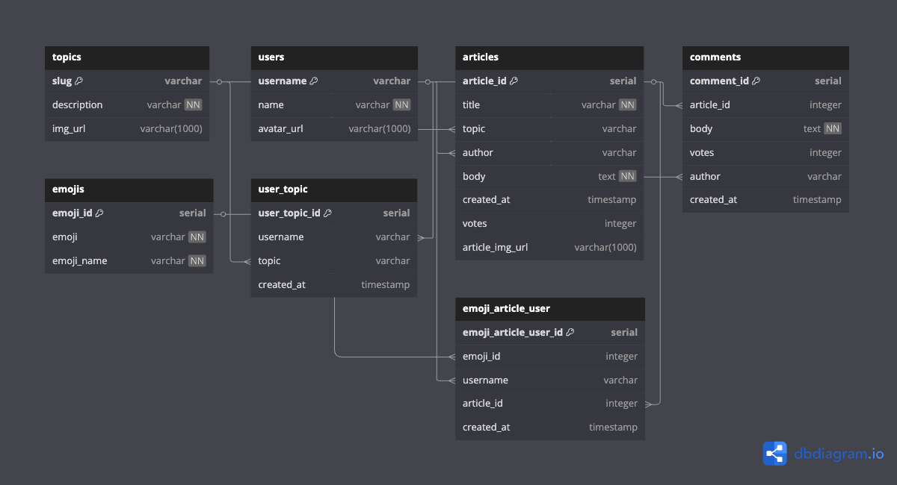

# NC News API

A RESTful API for a Reddit-style news website built with Node.js, Express, and PostgreSQL. Users can browse articles, leave comments, and vote on content.

🌐 **[Live API](https://news-be-k14i.onrender.com/)**

## Features

- Browse articles by topic, author, and date
- Sort and filter articles with query parameters
- Add and delete comments
- Vote on articles and comments
- User management system
- Comprehensive error handling

## Tech Stack

- **Backend**: Node.js, Express.js
- **Database**: PostgreSQL
- **Testing**: Jest, Supertest
- **Deployment**: Railway/Render

## API Endpoints

| Method | Endpoint | Description |
|--------|----------|-------------|
| GET | `/api` | Returns all available endpoints |
| GET | `/api/topics` | Returns all topics |
| GET | `/api/articles` | Returns all articles (with sorting/filtering) |
| GET | `/api/articles/:article_id` | Returns single article by ID |
| GET | `/api/articles/:article_id/comments` | Returns comments for an article |
| POST | `/api/articles/:article_id/comments` | Add comment to article |
| PATCH | `/api/articles/:article_id` | Update article votes |
| DELETE | `/api/comments/:comment_id` | Delete comment |
| GET | `/api/users` | Returns all users |

## Getting Started

### Prerequisites

- **Node.js**: v18.0.0 or higher
- **PostgreSQL**: v12.0 or higher

### Installation

1. Clone the repository:

   ```bash
   git clone https://github.com/Lauren21717/news-BE.git
   cd news-BE
   ```

2. Install dependencies:

   ```bash
   npm install
   ```

### Database Setup

This project requires two PostgreSQL databases: one for development and one for testing.

#### 1. Create the Databases

Run the setup script to create both databases:

```bash
npm run setup-dbs
```

#### 2. Environment Variables

You must create two `.env` files in the root directory to connect to your databases:

- `.env.development`

    ```ini
    PGDATABASE=nc_news
    ```

- `.env.test`

    ```ini
    PGDATABASE=nc_news_test
    ```

> **Note:** These `.env` files are ignored by Git for security reasons. Each developer needs to create their own locally.

#### 3. Seed the Development Database

Populate the development database with data:

```bash
npm run seed-dev
```

#### 4. Testing

Run the database tests to verify your setup:

```bash
npm run test-seed
```

## Database Schema

The NC News API uses a PostgreSQL database with the following structure:

- 

### Core Tables
- **topics**: News categories
- **users**: Registered users who can write articles and comments
- **articles**: News articles written by users
- **comments**: User comments on articles

### Advanced Features
- **emojis**: Available emoji reactions
- **user_topic**: Tracks which topics users follow
- **emoji_article_user**: Logs emoji reactions on articles

### Key Relationships
- Users can write multiple articles and comments
- Articles belong to topics and can have many comments
- Users can follow multiple topics (many-to-many via user_topic)
- Users can react to articles with emojis (many-to-many via emoji_article_user)
